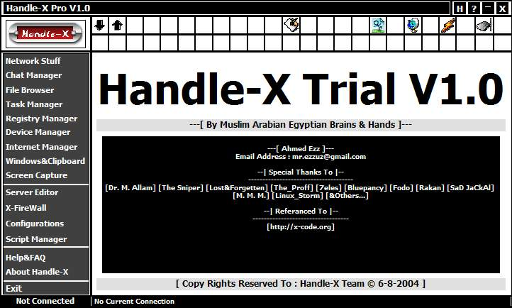



## Handle\-X Trial V1\.0

### Description

Used For Network Administration ,Controlling Systems and Hacking VIA any network type ...

The Tools Included [

1 - Multi Channle Connection Mnager .

2 - Net Address Book .

3 - Remote MsgBox/Matrix & Normal Text Chat/Half Duplex Voise Chat/White Board/Minesweeper Detecting Game .

4 - Complete Functionality Remote File Browser & Manager (Download & Upload Files) .

5 - Multi-threaded Remote Download Manager .

6 - Complete Functionality Remote Processes and Application Mnager Much stronger than The Normal Windows Task Mnager .

7 - Remote Registry Manager such [regedit.exe] .

8 - Some Interbet functions included such fetch the remoted system history .

9 - Remoted ClipBoard Controller .

10 - Mass Device manager includes Strong monitor controlling .

11 - Of cource the windows OS controlling functions is included such as shutdown , restart ...etc .

12 - Simple Server Editor .

13 - Embeded Firewall .

14 - Many Network tools such "X-Ping , X-Router , X-Whois , X-Port Scanner ,....) .

15 - The X-Editor is still under construction .

16 - The Help & Documentation is also not completed. ]

[Notes]

1 - Handle-X is built on a new application-layer protocol called BBP (Byte Based Protocol) .

2 - The Transmition data is not encrypted and not compressed untill now .

3 - Also i'm searching now to support LAN Hacking .

[Enjoy]
 
### More Info
 
Side Efects :-

----

Be Sure that the server still untill now don't load it'self at startup or hide it's self from processes window ... also it open only one port.

             |
---                |---
**Submitted On**   |2005-03-31 10:02:04
**By**             |[Ahmed Ezz](https://github.com/Planet-Source-Code/PSCIndex/blob/master/ByAuthor/ahmed-ezz.md)
**Level**          |Advanced
**User Rating**    |5.0 (50 globes from 10 users)
**Compatibility**  |VB 5\.0, VB 6\.0
**Category**       |[Complete Applications](https://github.com/Planet-Source-Code/PSCIndex/blob/master/ByCategory/complete-applications__1-27.md)
**World**          |[Visual Basic](https://github.com/Planet-Source-Code/PSCIndex/blob/master/ByWorld/visual-basic.md)
**Archive File**   |[Handle\-X\_T187133432005\.zip](https://github.com/Planet-Source-Code/ahmed-ezz-handle-x-trial-v1-0__1-59815/archive/master.zip)

